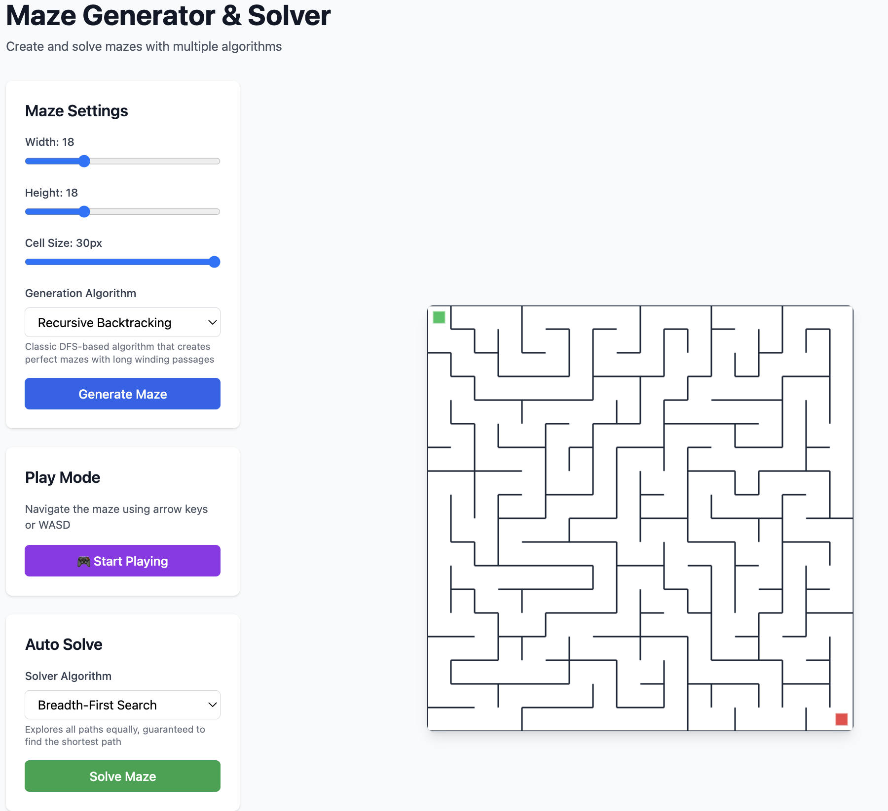

# 🎮 Interactive Maze Game

A fully extensible maze generation and solving application with **interactive gameplay**! Navigate mazes using arrow keys, track your stats, and compete for the best efficiency score. Built with Next.js, TypeScript, and Tailwind CSS.

  



## ✨ Features

### Maze Generation Algorithms
- **Recursive Backtracking** - Classic DFS-based algorithm creating perfect mazes with long winding passages
- **Prim's Algorithm** - Grows maze from a starting point with more organic branching patterns
- **Kruskal's Algorithm** - Creates mazes by randomly connecting disjoint sets with uniform complexity

### Maze Solving Algorithms
- **Breadth-First Search (BFS)** - Guaranteed shortest path
- **Depth-First Search (DFS)** - Faster but may not find shortest path
- **A* Search** - Heuristic-based efficient pathfinding

### Interactive Gameplay
- **Play Mode** - Navigate mazes using arrow keys or WASD
- **Real-time Stats** - Track moves, time, and efficiency
- **Win Detection** - Celebration modal when reaching the end
- **Game Controls** - Reset position, view hints, and more
- **Visual Feedback** - Shake animation for invalid moves
- **Player Visualization** - Purple circle representing your position

### Configuration Features
- Adjustable maze dimensions (5x5 to 50x50)
- Variable cell size for better visualization
- Real-time solution path visualization
- Toggle solution/hint display
- Path length and efficiency calculation

## 🚀 Quick Start - Building Locally

### Prerequisites

Before you begin, make sure you have the following installed:

- **Node.js** (version 18 or higher)
  - Check version: `node --version`
  - Download: [nodejs.org](https://nodejs.org/)
- **npm** (comes with Node.js) or **yarn**
  - Check version: `npm --version`
- **Git** (optional, for cloning)
  - Download: [git-scm.com](https://git-scm.com/)

### Step-by-Step Installation

#### 1. Install Dependencies

```bash
npm install
```

This will install all required packages (~200MB). It may take a few minutes.

#### 2. Run the Development Server

```bash
npm run dev
```

You should see output like:
```
✓ Ready in 1.4s
- Local:   http://localhost:3000
```

#### 3. Open in Browser

Open your browser and navigate to:
```
http://localhost:3000
```

🎉 **You're ready to play!**

### 🎮 How to Play

1. **Generate a Maze** - Click "Generate Maze" button
2. **Start Playing** - Click "🎮 Start Playing"
3. **Navigate** - Use **Arrow Keys** or **WASD** to move
4. **Reach the Goal** - Navigate to the red square to win!
5. **View Stats** - Check your time, moves, and efficiency

### 📦 Available Commands

```bash
# Development server (with hot reload)
npm run dev

# Run all tests
npm test

# Run tests in watch mode
npm run test:watch

# Build for production
npm run build

# Start production server (after build)
npm start

# Lint code
npm run lint
```

### 🐛 Troubleshooting

**Port already in use?**
- The app will automatically use the next available port (3001, 3002, etc.)
- Or manually specify: `npm run dev -- -p 3001`

**Installation errors?**
- Delete `node_modules` folder and `package-lock.json`
- Run `npm install` again
- Make sure you're using Node.js 18+

**Can't find module errors?**
- Run `npm install` again
- Check that you're in the correct directory

**Build fails?**
- Clear Next.js cache: `rm -rf .next`
- Run `npm run build` again

### 🌐 Share with Others

#### Option 1: Run Locally
Share the project folder, and others can follow these same steps.

#### Option 2: Deploy to Vercel (Free)

1. Push code to GitHub
2. Visit [vercel.com](https://vercel.com)
3. Click "Import Project"
4. Select your repository
5. Click "Deploy"

Your maze game will be live at: `https://your-project.vercel.app`

#### Option 3: Build and Share Static Files

```bash
npm run build
npm start
```

The app will run on your local network, accessible to others on the same WiFi.

## Project Structure

```
maze-app/
├── src/
│   ├── app/                    # Next.js app directory
│   │   ├── page.tsx           # Main application page
│   │   ├── layout.tsx         # Root layout
│   │   └── globals.css        # Global styles + animations
│   ├── components/            # React components
│   │   ├── MazeCanvas.tsx     # Canvas-based maze renderer
│   │   └── WinModal.tsx       # Victory celebration modal
│   ├── lib/                   # Core logic
│   │   ├── gameLogic.ts       # Movement validation, win detection
│   │   ├── maze/              # Maze generation algorithms
│   │   │   ├── MazeBase.ts
│   │   │   ├── RecursiveBacktracking.ts
│   │   │   ├── PrimsAlgorithm.ts
│   │   │   ├── KruskalsAlgorithm.ts
│   │   │   ├── index.ts
│   │   │   └── __tests__/
│   │   └── solvers/           # Maze solving algorithms
│   │       ├── BFSSolver.ts
│   │       ├── DFSSolver.ts
│   │       ├── AStarSolver.ts
│   │       ├── index.ts
│   │       └── __tests__/
│   └── types/                 # TypeScript type definitions
│       └── maze.ts
├── jest.config.js             # Jest configuration
├── jest.setup.js              # Jest setup
├── next.config.js             # Next.js configuration
├── tailwind.config.js         # Tailwind CSS configuration
├── tsconfig.json              # TypeScript configuration
├── vercel.json                # Vercel deployment config
└── FEATURES.md                # Detailed feature guide
```

## Extensibility

### Adding a New Maze Generator

1. Create a new file in `src/lib/maze/`:

```typescript
import { MazeGenerator, Maze } from '@/types/maze';
import { MazeBase } from './MazeBase';

export class MyAlgorithm extends MazeBase implements MazeGenerator {
  name = 'My Algorithm';
  description = 'Description of your algorithm';

  generate(width: number, height: number): Maze {
    const maze = this.createEmptyMaze(width, height);
    // Your algorithm implementation
    return maze;
  }
}
```

2. Register it in `src/lib/maze/index.ts`
3. Add the algorithm type to `src/types/maze.ts`

### Adding a New Solver

1. Create a new file in `src/lib/solvers/`:

```typescript
import { MazeSolver, Maze } from '@/types/maze';

export class MySolver implements MazeSolver {
  name = 'My Solver';
  description = 'Description of your solver';

  solve(maze: Maze): { row: number; col: number }[] | null {
    // Your solving algorithm
    return path;
  }
}
```

2. Register it in `src/lib/solvers/index.ts`
3. Add the solver type to `src/types/maze.ts`

## 🧪 Testing

The project includes comprehensive test coverage for maze generation, solving algorithms, and game logic.

```bash
# Run all tests (26+ tests)
npm test

# Run tests in watch mode (auto-rerun on changes)
npm run test:watch

# Run specific test file
npm test gameLogic
```

**Test Coverage:**
- ✅ Maze generation algorithms
- ✅ Pathfinding solvers (BFS, DFS, A*)
- ✅ Movement validation
- ✅ Win condition detection
- ✅ Game utility functions

All tests should pass before deployment!

## Deployment

### Vercel (Recommended)

1. Push your code to GitHub
2. Import your repository on [Vercel](https://vercel.com)
3. Vercel will automatically detect Next.js and deploy

Or use the Vercel CLI:

```bash
npm install -g vercel
vercel
```

### Other Platforms

The app can be deployed to any platform that supports Next.js:
- Netlify
- Railway
- AWS Amplify
- Google Cloud Run
- And more!

## 💻 Technologies

- **Next.js 15** - React framework with App Router
- **TypeScript 5** - Type safety and better developer experience
- **Tailwind CSS 3** - Utility-first styling
- **HTML5 Canvas** - High-performance maze rendering
- **Jest 30** - Testing framework with JSDOM

## 📖 Documentation

- **README.md** (this file) - Setup and overview
- **FEATURES.md** - Detailed feature guide and gameplay tips
- Inline code comments throughout

## 🤝 Contributing

Contributions are welcome! Here's how:

1. Fork the repository
2. Create a feature branch (`git checkout -b feature/amazing-feature`)
3. Make your changes
4. Run tests (`npm test`)
5. Commit changes (`git commit -m 'Add amazing feature'`)
6. Push to branch (`git push origin feature/amazing-feature`)
7. Open a Pull Request

## 📝 License

MIT License - feel free to use this project for learning, personal, or commercial purposes!

## 🙋 Support

Having issues? Check:
1. **Troubleshooting section** above
2. **FEATURES.md** for gameplay help
3. Run `npm test` to verify installation
4. Check Node.js version: `node --version` (should be 18+)

## 🎯 What's Next?

Potential features to add:
- [ ] Touch/swipe controls for mobile
- [ ] Multiplayer race mode
- [ ] Leaderboard with localStorage
- [ ] More maze algorithms (Wilson's, Eller's)
- [ ] Custom start/end positions
- [ ] Dark mode theme
- [ ] Animation speed controls
- [ ] Export maze as image

---

**Made with ❤️ using Next.js and TypeScript**

Ready to play? Run `npm run dev` and navigate to `http://localhost:3000`!
